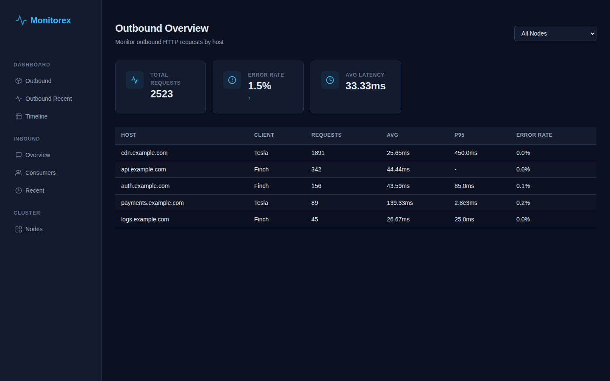
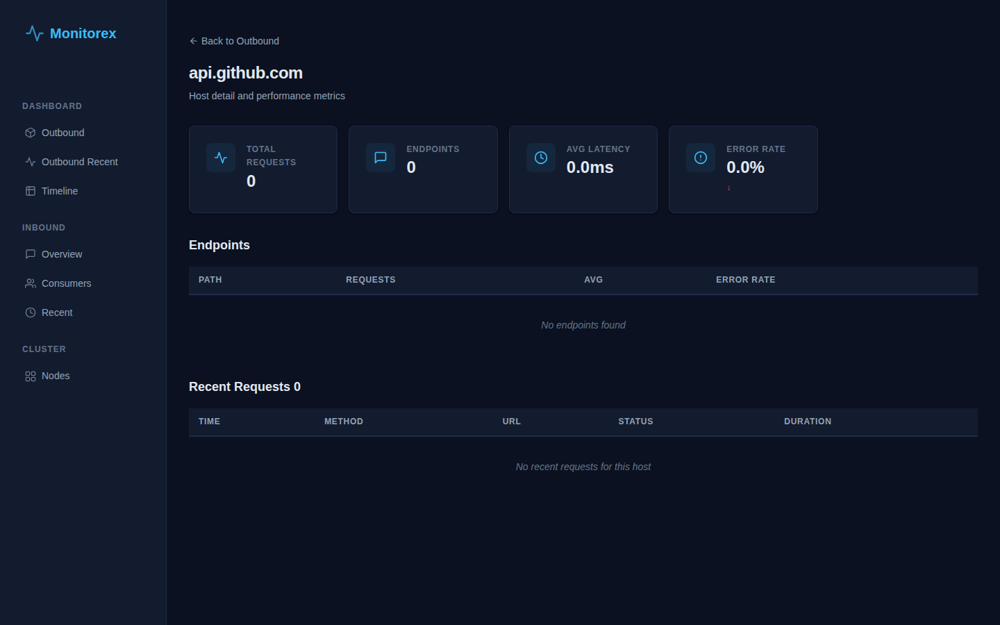
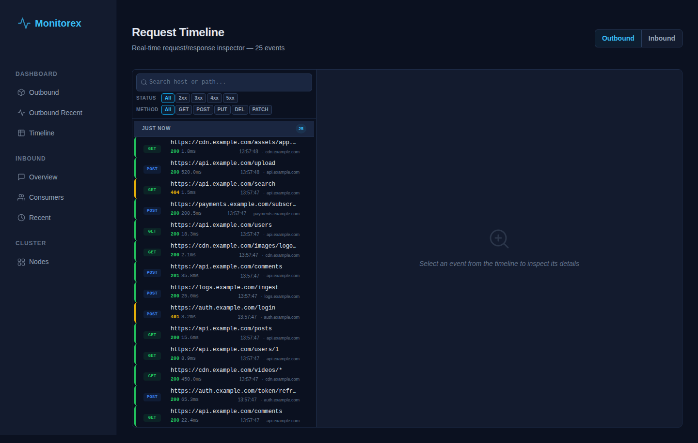

# Monitorex

[](https://github.com/GustavoZiaugra/monitorex/actions/workflows/ci.yml)
[](https://hex.pm/packages/monitorex)
[](https://hexdocs.pm/monitorex)
[](https://hex.pm/packages/monitorex)
[](https://github.com/GustavoZiaugra/monitorex/blob/main/LICENSE.md)

**Real-time HTTP telemetry dashboard for Elixir/Phoenix applications.**

Monitorex monitors outbound (Tesla, Finch/Req) and inbound (Phoenix) HTTP traffic, aggregates it into ETS-backed metrics, and renders a live-updating dark-theme dashboard — no database required.



## Features

- **Outbound monitoring** — track HTTP requests from Tesla, Finch, or Req
- **Inbound monitoring** — track Phoenix router dispatch with per-consumer breakdowns
- **Live dashboard** — 8 pages: Overview, Outbound/Inbound, host/route detail, timeline, consumer analytics
- **Timeline inspector** — split-pane page with event list + request/response detail viewer
- **Auto-refresh** — LiveView updates every 2 seconds
- **Sort, filter, paginate** — interactive data tables on every page
- **Responsive** — works on desktop and mobile (collapsible sidebar, card-layout tables)
- **Dark theme** — polished design system with SVG icons and custom properties
- **Cluster support** — aggregate data across multiple BEAM nodes
- **Health check** — `GET /monitorex/health` with Collector status, queue depths, ETS sizes
- **Prometheus metrics** — `GET /monitorex/metrics` for requests, errors, latency, ETS sizes
- **Alert webhooks** — configurable thresholds (error_rate, host_down, high_latency) with debounced dispatch
- **No database** — all data lives in ETS tables (in-memory)

## Screenshots

| Outbound Overview | Host Detail | Timeline Inspector |
|:---:|:---:|:---:|
|  |  |  |

## Installation

Add `monitorex` to your `mix.exs`:

```elixir
def deps do
  [
    {:monitorex, "~> 0.4.0"}
  ]
end
```

Then run:

```bash
mix deps.get
```

## Quick Start

### 1. Configure sources

In `config/config.exs`:

```elixir
config :monitorex, :sources, [:tesla, :finch, :req, :phoenix]
```

### 2. Mount the dashboard in your router

```elixir
# lib/my_app_web/router.ex
defmodule MyAppWeb.Router do
  use Phoenix.Router
  import Monitorex.Router

  pipeline :browser do
    plug :accepts, ["html"]
    plug :fetch_session
    plug :fetch_live_flash
    plug :put_root_layout, html: {MyAppWeb.Layouts, :root}
    plug :protect_from_forgery
  end

  scope "/monitoring" do
    pipe_through :browser
    http_dashboard []
  end
end
```

### 3. Start your server

```bash
mix phx.server
```

Visit `/monitoring` to see your dashboard.

## Configuration

### Sources

```elixir
config :monitorex, :sources, [:tesla, :finch, :phoenix]
```

Available sources: `:tesla`, `:finch`, `:req`, `:phoenix`. Only attach the sources you use.

### Inbound path filtering

Only track requests under specific path prefixes:

```elixir
config :monitorex, :inbound_path_prefixes, ["/api", "/graphql"]
```

When not configured, all paths are tracked.

### Authentication & Access Control

Implement the `Monitorex.Resolver` behaviour to control dashboard access:

```elixir
defmodule MyApp.MonitorexResolver do
  @behaviour Monitorex.Resolver

  @impl true
  def resolve_user(conn) do
    # Return a map with user info from your session/auth system
    case get_session(conn, :current_user) do
      nil -> %{id: nil, name: "guest"}
      user -> %{id: user.id, name: user.name}
    end
  end

  @impl true
  def resolve_access(%{id: nil}) do
    # Redirect unauthenticated users to login
    {:forbidden, "/login"}
  end

  def resolve_access(_user) do
    :all
  end
end
```

Configure it:

```elixir
config :monitorex, :resolver, MyApp.MonitorexResolver
```

If no resolver is configured, a default resolver grants full access (`:all`).

### Consumer Identification

Monitorex identifies inbound consumers by priority:

1. **Custom function** — your own `consumer_fn`:
   ```elixir
   config :monitorex, :consumer_fn, &MyApp.extract_consumer/1
   ```
2. **Basic-auth username** — decoded from `Authorization: Basic ...`
3. **API key header** — value of `X-Api-Key` (first 8 characters)

### Deduplication

When both Tesla and Finch are used in the same application, the same HTTP request may fire events from both libraries. Enable dedup to prevent double-counting:

```elixir
config :monitorex, :clients, [:tesla, :finch]
```

### Request/Response Detail Capture

Monitorex can capture HTTP headers and bodies for detailed inspection.

**Header redaction**

Sensitive header values are automatically redacted before storage:

```elixir
config :monitorex, :redacted_headers, [
  "authorization",
  "cookie",
  "set-cookie",
  "x-api-key",
  "x-auth-token"
]
```

**Body storage**

Body capture is disabled by default to limit memory usage:

```elixir
# Store request and/or response bodies on the Event struct
config :monitorex, :store_request_body, true
config :monitorex, :store_response_body, true

# Truncate bodies larger than N bytes (default: 10_000)
config :monitorex, :max_body_bytes, 10_000
```

### Memory Management

To prevent unbounded ETS growth in production, Monitorex caps aggregate tables and prunes stale entries:

```elixir
# Maximum entries per aggregate table (hosts, endpoints, routes, consumers)
# When exceeded, oldest entries are dropped during cleanup.
config :monitorex, :max_endpoints, 2_000

# Recent event ring buffers (per direction)
config :monitorex, :max_recent, 500       # outbound
config :monitorex, :max_recent_inbound, 500  # inbound

# Stale entry TTL (aggregate tables)
config :monitorex, :endpoint_ttl, :timer.hours(1)
```

Monitor runtime memory usage:

```elixir
Monitorex.memory_usage()
# => %{tables: %{monitorex_outbound_hosts: %{size: 42, memory_words: 1234}, ...},
#     total_words: 46089, total_kb: 18.53}
```

The **health endpoint** (`GET /monitorex/health`) also exposes current ETS table sizes and total memory under `ets_table_sizes` and `total_ets_memory_words`.

## Pages

| Page | URL | Description |
|------|-----|-------------|
| Outbound Overview | `/` | Summary cards + host table |
| Outbound Recent | `/outbound_recent` | Live feed with status filter |
| Host Detail | `/host/:host` | Per-endpoint breakdown + recent requests |
| Inbound Overview | `/inbound` | Route table + summary |
| Inbound Consumers | `/inbound_consumers` | Per-consumer stats |
| Inbound Recent | `/inbound_recent` | Live feed with filters |
| Timeline | `/timeline` | Split-pane event inspector with request/response detail |
| Route Detail | `/route/:key` | Consumer breakdown + recent requests |

## Asset Pipeline

Monitorex ships pre-built CSS and JS assets. To rebuild them from source:

```bash
mix assets.build
```

Source files are in `assets/css/app.css` and `assets/js/app.js`. The build uses Tailwind CSS v4 and esbuild.

## Development

```bash
git clone https://github.com/GustavoZiaugra/monitorex.git
cd monitorex
mix deps.get
mix compile --warnings-as-errors

# Run tests
mix test

# Run demo server
mix run scripts/demo.exs

# Validate as Phoenix dependency
cd /tmp
mix phx.new demo_monitorex --no-ecto --no-mailer --no-dashboard --no-gettext
cd demo_monitorex
# add {:monitorex, path: "/path/to/monitorex"} to mix.exs
mix deps.get && mix compile
```

## Docs

```bash
mix docs
```

Then open `doc/index.html`.

## License

MIT
