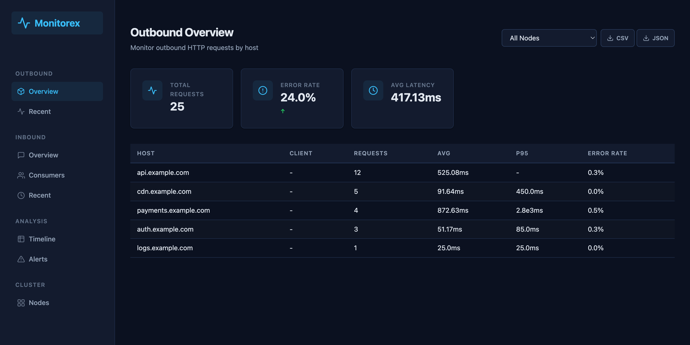
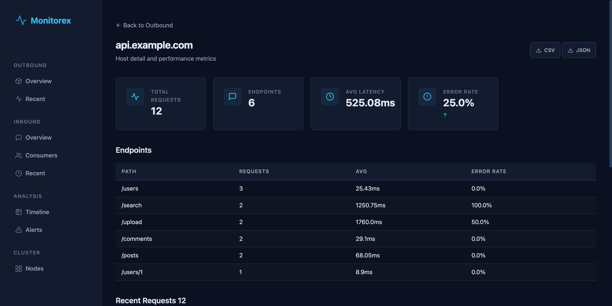
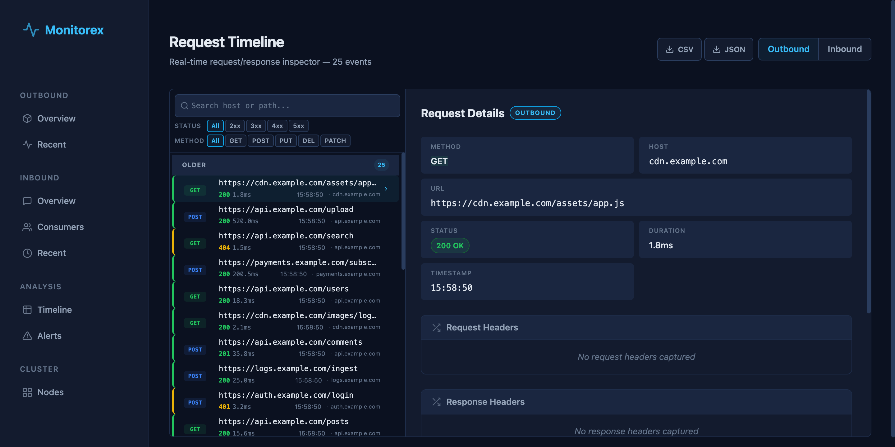

# Monitorex

[](https://github.com/GustavoZiaugra/monitorex/actions/workflows/ci.yml)
[](https://hex.pm/packages/monitorex)
[](https://hexdocs.pm/monitorex)
[](https://hex.pm/packages/monitorex)
[](https://github.com/GustavoZiaugra/monitorex/blob/main/LICENSE.md)

**Real-time HTTP telemetry dashboard for Elixir/Phoenix applications.**

Monitorex monitors outbound (Tesla, Finch/Req) and inbound (Phoenix) HTTP traffic, aggregates it into ETS-backed metrics, and renders a live-updating dark-theme dashboard — no database required.



## Features

- **Outbound monitoring** — track HTTP requests from Tesla, Finch, or Req
- **Inbound monitoring** — track Phoenix router dispatch with per-consumer breakdowns
- **Mount anywhere** — works at any path prefix (e.g. `/monitoring`); nav links, assets, exports and the LiveView socket are prefix-aware
- **One-command install** — `mix igniter.install monitorex` sets up the dependency, router mount, source detection and Tesla-on-Finch dedup
- **Live dashboard** — 8 pages: Overview, Outbound/Inbound, host/route detail, timeline, consumer analytics
- **Timeline inspector** — split-pane page with event list + request/response detail viewer
- **Auto-refresh** — LiveView updates every 2 seconds
- **Sort, filter, paginate** — interactive data tables on every page
- **Responsive** — works on desktop and mobile (collapsible sidebar, card-layout tables)
- **Dark theme** — polished design system with SVG icons and custom properties
- **Cluster support** — aggregate data across multiple BEAM nodes
- **Health check** — `GET /monitorex/health` with Collector status, queue depths, ETS sizes
- **Prometheus metrics** — `GET /monitorex/metrics` for requests, errors, latency, ETS sizes
- **Alert webhooks** — configurable thresholds (error_rate, host_down, high_latency) with debounced dispatch
- **CSV/JSON export** — download any dashboard view as `.csv` or `.json`
- **REST API** — programmatic access to hosts, routes, events, and metrics via JSON endpoints
- **Slow request tracing** — automatic capture of request/response bodies for requests exceeding a latency threshold
- **Alert Center** — live alerts page with firing status, history, acknowledge, and snooze controls
- **Alert History** — GenServer-backed ETS storage for alert records with lifecycle management
- **Native notifications** — Slack, Discord, and Email notifiers with debounced dispatch
- **Persistent storage** — optional SQLite backend via swappable `Storage.Backend` behaviour (ETS remains default)
- **No database required** — all data lives in ETS tables (in-memory) by default

## Screenshots

| Outbound Overview | Host Detail | Timeline Inspector |
|:---:|:---:|:---:|
|  |  |  |

## Installation

### Installer (recommended)

The fastest way to add Monitorex is with [Igniter](https://hex.pm/packages/igniter), the
standard installer framework for Elixir. It inspects your application and configures
Monitorex automatically, showing a diff before writing anything:

```bash
# install igniter if you don't have it yet
mix archive.install hex igniter_new

# install and configure monitorex
mix igniter.install monitorex
```

The installer detects from your application's AST:

| Decision | Detection |
|---|---|
| Which sources to enable | which of `:tesla` / `:finch` / `:req` are in your dep tree (`:phoenix` is always enabled) |
| Whether dedup is needed | `config :tesla, adapter: {Tesla.Adapter.Finch, _}` present → sets `clients: [:tesla, :finch]` |
| REST API handling | the built-in API is disabled (`http_dashboard api_path: false`) so it never collides with an existing `scope "/api"` |
| Where to mount | `--path` option, default `/monitoring` (warns if it collides with an existing scope) |
| `req_telemetry` requirement | `:req` present but `:req_telemetry` absent → offered as a dependency |

It writes the `config :monitorex, :sources` config, adds `import Monitorex.Router` plus a
`scope` + `pipe_through :monitoring` mount in your router, and adds `req_telemetry` when
needed. The mount uses a dedicated `:monitoring` pipeline **without** `protect_from_forgery`
so the dashboard assets aren't rejected with a 403 (see the installation guide). The manual
steps below remain fully supported — the installer automates them, it does not replace them.

### Manual installation

Add `monitorex` to your `mix.exs`:

```elixir
def deps do
  [
    {:monitorex, "~> 0.8.0"}
  ]
end
```

Then run:

```bash
mix deps.get
```

## Quick Start

> **For a real Phoenix app, read the [Installation Guide](guides/getting_started.md) first.** The steps below include the essentials that the happy path leaves out (REST API security, pipeline requirements, Tesla-on-Finch dedup).

### 1. Configure sources and deduplication

In `config/config.exs`:

```elixir
# Only attach the sources you use. :phoenix monitors inbound; the rest are outbound.
config :monitorex, :sources, [:tesla, :finch, :req, :phoenix]

# REQUIRED if Tesla runs on the Finch adapter (very common): both libraries
# emit telemetry for the same request, so without this every outbound request
# is counted twice.
config :monitorex, :clients, [:tesla, :finch]
```

### 2. Mount the dashboard in your router

The dashboard scope needs a pipeline **without** `protect_from_forgery` (it
rejects the cross-origin script GET with a 403 on `app.js`; CSS is unaffected)
and **without** your app's CSP plug (Monitorex scripts carry no nonce). Mount on
a dedicated host or a path prefix:

```elixir
# lib/my_app_web/router.ex
defmodule MyAppWeb.Router do
  use MyAppWeb, :router
  import Monitorex.Router

  # Dashboard pipeline — mirrors :browser minus protect_from_forgery / CSP.
  pipeline :monitoring do
    plug :accepts, ["html"]
    plug :fetch_session
    plug :fetch_live_flash
  end

  scope "/", host: "monitoring." do
    pipe_through :monitoring
    # api_path: false — the REST API is unauthenticated and defaults to /api.
    http_dashboard api_path: false
  end
end
```

Point a `monitoring.` subdomain at your app, or use a path prefix (`scope "/monitoring"`).

### 3. Start your server

```bash
mix phx.server
```

Visit your dashboard (e.g. `http://monitoring.localhost:4000` or `/monitoring`) to see it.

### Mounting: path prefix vs. dedicated host

`http_dashboard/1` emits **scope-relative** routes (`live "/"`, `get("/dashboard-assets/*path")`, `forward("/api")`), so a path prefix such as `scope "/monitoring"` is supported at the router level. However, the current release's bundled layout still hardcodes root-relative asset URLs (`/dashboard-assets/app.css`) and nav links; the layout-fix for prefix mounts is in progress. Until it merges, mount at the root of a dedicated host:

```elixir
scope "/", host: "monitoring." do
  pipe_through :monitoring
  http_dashboard api_path: false
end
```

Point a `monitoring.` subdomain at your app and the dashboard's root-relative URLs resolve correctly. See the [Installation Guide](guides/getting_started.md) for the full matrix.

### Mounting under a path prefix

The dashboard is fully mountable under a path prefix. Asset links and
navigation links are derived from the mount point, so a `scope "/monitoring"`
(or mounting the endpoint behind a reverse proxy) works out of the box.

The LiveView client connects to your app's LiveView socket endpoint. By
default it uses `/live`; pass `:socket_path` if your app mounts
`Phoenix.LiveView.Socket` elsewhere:

```elixir
scope "/monitoring" do
  pipe_through :browser
  http_dashboard socket_path: "/live"
end
```

Make sure the pipeline includes `:protect_from_forgery` (or
`Plug.CSRFProtection`) so the dashboard can read the CSRF token it needs to
establish the LiveView socket connection.

## Configuration

### Sources

```elixir
config :monitorex, :sources, [:tesla, :finch, :phoenix]
```

Available sources: `:tesla`, `:finch`, `:req`, `:phoenix`. Only attach the sources you use.

> **⚠️ Req source requires `req_telemetry`** — Req 0.5.x removed built-in telemetry. Add `{:req_telemetry, "~> 0.1"}` to your `mix.exs` deps for Req events to fire. Alternatively, Req runs on Finch, so the `:finch` source captures Req traffic (with full request/response details) without `req_telemetry`.

### Inbound path filtering

Only track requests under specific path prefixes:

```elixir
config :monitorex, :inbound_path_prefixes, ["/api", "/graphql"]
```

When not configured, all paths are tracked.

### Authentication & Access Control

Implement the `Monitorex.Resolver` behaviour to control dashboard access:

```elixir
defmodule MyApp.MonitorexResolver do
  @behaviour Monitorex.Resolver

  @impl true
  def resolve_user(conn) do
    # Return a map with user info from your session/auth system
    case get_session(conn, :current_user) do
      nil -> %{id: nil, name: "guest"}
      user -> %{id: user.id, name: user.name}
    end
  end

  @impl true
  def resolve_access(%{id: nil}) do
    # Redirect unauthenticated users to login
    {:forbidden, "/login"}
  end

  def resolve_access(_user) do
    :all
  end
end
```

Configure it:

```elixir
config :monitorex, :resolver, MyApp.MonitorexResolver
```

If no resolver is configured, a default resolver grants full access (`:all`).

### Consumer Identification

Monitorex identifies inbound consumers by priority:

1. **Custom function** — your own `consumer_fn`:
   ```elixir
   config :monitorex, :consumer_fn, &MyApp.extract_consumer/1
   ```
2. **Basic-auth username** — decoded from `Authorization: Basic ...`
3. **API key header** — value of `X-Api-Key` (first 8 characters)

### Deduplication

> **⚠️ Required if Tesla runs on the Finch adapter.** Tesla's Finch adapter emits both `:tesla` and `:finch` telemetry events for the same request. Without dedup, every outbound request is counted twice.

Enable dedup by listing both clients:

```elixir
config :monitorex, :clients, [:tesla, :finch]
```

### Request/Response Detail Capture

Monitorex can capture HTTP headers and bodies for detailed inspection.

**Header redaction**

Sensitive header values are automatically redacted before storage:

```elixir
config :monitorex, :redacted_headers, [
  "authorization",
  "cookie",
  "set-cookie",
  "x-api-key",
  "x-auth-token"
]
```

**Body storage**

Body capture is disabled by default to limit memory usage. Without it, the timeline detail pane shows headers but **empty bodies** — enable it to see request/response bodies:

```elixir
# Store request and/or response bodies on the Event struct
config :monitorex, :store_request_body, true
config :monitorex, :store_response_body, true

# Truncate bodies larger than N bytes (default: 10_000)
config :monitorex, :max_body_bytes, 10_000
```

Slow requests (past `:slow_request_threshold_ms`) capture bodies even when this is disabled.

### Memory Management

To prevent unbounded ETS growth in production, Monitorex caps aggregate tables and prunes stale entries:

```elixir
# Maximum entries per aggregate table (hosts, endpoints, routes, consumers)
# When exceeded, oldest entries are dropped during cleanup.
config :monitorex, :max_endpoints, 2_000

# Recent event ring buffers (per direction)
config :monitorex, :max_recent, 500       # outbound
config :monitorex, :max_recent_inbound, 500  # inbound

# Stale entry TTL (aggregate tables)
config :monitorex, :endpoint_ttl, :timer.hours(1)
```

> **Data lifetime:** storage is ETS (in-memory) by default — everything is lost on restart. Enable the SQLite backend for persistence (below). The recent buffers hold `:max_recent` events per direction and **silently evict older events**, which breaks `?selected=` deep links (e.g. `/timeline?selected=1779232233155167`) once an event is evicted.

### Slow Request Tracing

Monitorex can automatically flag and retain detailed traces for slow requests. When a request exceeds the configured threshold, full request/response bodies are captured even if body storage is globally disabled — providing debugging data without the memory overhead of storing all bodies.

```elixir
# Latency threshold in milliseconds (default: 2_000)
config :monitorex, :slow_request_threshold_ms, 2_000

# Maximum slow requests retained per direction (default: 200)
config :monitorex, :max_slow, 200
```

Set `:slow_request_threshold_ms` to `nil` or `0` to disable slow request tracing entirely.

Slow events are stored in separate ETS tables (`:monitorex_slow_outbound` and `:monitorex_slow_inbound`) and exposed via `Monitorex.Storage.list_slow_outbound/1` and `list_slow_inbound/1` for custom dashboards or alerting integrations.

Monitor runtime memory usage:

```elixir
Monitorex.memory_usage()
# => %{tables: %{monitorex_outbound_hosts: %{size: 42, memory_words: 1234}, ...},
#     total_words: 46089, total_kb: 18.53}
```

The **health endpoint** (`GET /monitorex/health`) also exposes current ETS table sizes and total memory under `ets_table_sizes` and `total_ets_memory_words`.

### Storage Backend

By default, Monitorex stores all data in ETS tables (in-memory). You can optionally enable SQLite persistence so metrics survive BEAM restarts:

```elixir
# Use ETS (default)
config :monitorex, :storage_backend, Monitorex.Storage.ETS

# Use SQLite — requires :exqlite in your deps
config :monitorex, :storage_backend, Monitorex.Storage.SQLite
config :monitorex, :sqlite_path, "/var/lib/monitorex/data.db"
```

SQLite is compiled **conditionally** — if `exqlite` is not present, Monitorex falls back to ETS automatically. Add `{:exqlite, "~> 0.29"}` to your `mix.exs` to use it.

### Alerts & Notifications

Configure alert rules and notification channels:

```elixir
# Alert thresholds evaluated every cleanup cycle
config :monitorex, :alerts, [
  %{name: :high_error_rate, condition: :error_rate, threshold: 0.05},
  %{name: :host_down, condition: :host_down, threshold: 3},
  %{name: :high_latency, condition: :high_latency, threshold: 1_000}
]

# Slack webhook
config :monitorex, :slack_webhook_url, "https://hooks.slack.com/services/..."

# Discord webhook
config :monitorex, :discord_webhook_url, "https://discord.com/api/webhooks/..."

# SMTP (requires :gen_smtp)
config :monitorex, :smtp,
  relay: "smtp.example.com",
  username: "alerts@example.com",
  password: "secret",
  from: "monitorex@example.com",
  to: ["oncall@example.com"]
```

Rules can also be added/removed at runtime via `Monitorex.Alerts.add_rule/1` and `remove_rule/1`.

## Pages

| Page | URL | Description |
|------|-----|-------------|
| Outbound Overview | `/` | Summary cards + host table |
| Outbound Recent | `/outbound_recent` | Live feed with status filter |
| Host Detail | `/host/:host` | Per-endpoint breakdown + recent requests |
| Inbound Overview | `/inbound` | Route table + summary |
| Inbound Consumers | `/inbound_consumers` | Per-consumer stats |
| Inbound Recent | `/inbound_recent` | Live feed with filters |
| Timeline | `/timeline` | Split-pane event inspector with request/response detail |
| Route Detail | `/route/:key` | Consumer breakdown + recent requests |
| Alerts | `/alerts` | Alert summary, firing alerts, history table |

## REST API

> **⚠️ Security warning.** Monitorex ships a built-in JSON REST API that mounts **outside** `live_session` with **no authentication** — anyone who can reach your endpoint can read hosts, events, and metrics. It defaults to `api_path: "/api"`, which collides with the API scope of most real apps. **Disable it unless you need it:** pass `api_path: false` to `http_dashboard/1` (see below). The API also sends `Access-Control-Allow-Origin: *`, so it is effectively public even on an authenticated dashboard scope.

Monitorex ships a built-in JSON REST API for programmatic access to telemetry data. The API is auto-mounted at `/api` (configurable via the `:api_path` option in `http_dashboard/1`).

### Endpoints

| Endpoint | Description |
|---|---|
| `GET /api/health` | Health status (same as `/monitorex/health`) |
| `GET /api/hosts` | List all hosts with aggregate stats |
| `GET /api/hosts/:host` | Per-host detail with endpoint breakdown |
| `GET /api/routes` | Inbound route aggregates |
| `GET /api/consumers` | Consumer stats |
| `GET /api/events` | Recent events with filters (see below) |
| `GET /api/events/:timestamp` | Single event detail |
| `GET /api/metrics` | Computed metrics (RPS, error rate, latency quantiles) |

All endpoints return a consistent JSON envelope:

```json
{"ok": true, "data": ...}
```

Errors return:

```json
{"ok": false, "error": "message"}
```

### Query parameters

**Events** (`GET /api/events`):

| Param | Type | Default | Description |
|---|---|---|---|
| `direction` | string | `"outbound"` | `"outbound"` or `"inbound"` |
| `limit` | integer | 50 | Max results (max: 500) |
| `offset` | integer | 0 | Pagination offset |
| `host` | string | — | Filter by host (outbound only) |
| `method` | string | — | Filter by HTTP method (`GET`, `POST`, etc.) |
| `status` | integer | — | Filter by HTTP status code |
| `consumer` | string | — | Filter by consumer (inbound only) |
| `route` | string | — | Filter by route key (inbound only) |
| `since` | ISO 8601 | — | Events after this timestamp |

**Metrics** (`GET /api/metrics`):

| Param | Type | Default | Description |
|---|---|---|---|
| `host` | string | all | Filter to a specific host |
| `window` | integer | 300 | Time window in seconds for RPS/error rate |

### Pagination

Paginated endpoints (`/api/events`) return these response headers:

- `X-Total-Count` — total matching events
- `X-Page-Size` — the limit parameter used
- `X-Page-Offset` — the offset parameter used
- `X-Returned-Count` — actual returned count

### CORS

All endpoints include `Access-Control-Allow-Origin: *` and respond to `OPTIONS` preflight requests.

### Examples

```bash
# List all hosts
curl http://localhost:4000/api/hosts

# Outbound events filtered by host and status
curl "http://localhost:4000/api/events?direction=outbound&host=api.example.com&status=500"

# Metrics with 5-minute window
curl "http://localhost:4000/api/metrics?window=300"

# Single event by timestamp
curl "http://localhost:4000/api/events/1779232233155167"
```

### Disabling the API

Pass `api_path: false` to `http_dashboard/1` — recommended unless you need programmatic access:

```elixir
http_dashboard api_path: false
```

> The API is mounted inside the scope pipeline. If you keep it, mount it under your own pipeline and/or a dedicated path (see the [Installation Guide](guides/getting_started.md)).

## Asset Pipeline

Monitorex ships pre-built CSS and JS assets. To rebuild them from source:

```bash
mix assets.build
```

Source files are in `assets/css/app.css` and `assets/js/app.js`. The build uses Tailwind CSS v4 and esbuild.

## Development

```bash
git clone https://github.com/GustavoZiaugra/monitorex.git
cd monitorex
mix deps.get
mix compile --warnings-as-errors

# Run tests
mix test

# Run demo server
mix run scripts/demo.exs

# Validate as Phoenix dependency
cd /tmp
mix phx.new demo_monitorex --no-ecto --no-mailer --no-dashboard --no-gettext
cd demo_monitorex
# add {:monitorex, path: "/path/to/monitorex"} to mix.exs
mix deps.get && mix compile
```

## Docs

```bash
mix docs
```

Then open `doc/index.html`.

## License

MIT
